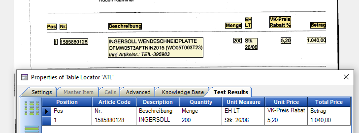

# Microsoft Azure Document Intelligence for Tungsten TotalAgility

**NOTE** The latest versions 1.0.7 onwards only support Document Intelligence 4.0 preview.

* If you want to include this in your own project simply copy the script [MicrosoftDI/W2/md/Project.vb](MicrosoftDI/W2/md/Project.vb) into the project level class of your project.
* Make sure you have created the 4 required [Script Variables](MicrosoftDI/W2/md/Project.md#Script-Variables).
  * Set **MicrosoftDocumentIntelligenceModel**  to **prebuilt-read** for OCR.
  * Set **MicrosoftDocumentIntelligenceModel**  to **prebuilt-tax.us.w2** for US tax W2 document.
* Make sure your default OCR profile is called **Microsoft DI**. This will trigger the script to skip Omnipage and call Microsoft.
* the project file **/MicrosoftDI/W2/project.fpr** can be imported into TotalAgility to either perform OCR or read W2 tax forms.

This documentation is for Microsoft Azure Document Intelligence.  
Click [here](https://github.com/TungstenTransformation/MicrosoftOCR/tree/Microsoft-Computer-Vision#readme) for documentation for [Microsoft Computer Vision](https://github.com/TungstenTransformation/MicrosoftOCR/tree/Microsoft-Computer-Vision#readme) (for photos and images).  
This repository supports different Microsoft OCR engines
* Document Intelligence 4.0 preview *optimized for documents*.
* [Azure Computer Vision OCR 3.2](https://github.com/TungstenTransformation/MicrosoftOCR/tree/Computer-Vision-OCR-3.2) *optimized for images and not documents*.
* **Azure AI Vision OCR for Images 4.0** *coming*

**NOTE** The correct model name for US W-2 tax forms is **prebuilt-tax.us.w2** and not **prebuilt-tax.us.W-2**. The [microsoft website](https://learn.microsoft.com/en-us/azure/ai-services/document-intelligence/concept-tax-document?view=doc-intel-4.0.0) is incorrect.  

[Install Microsoft OCR and DI on premise](/MicrosoftOCR_OnPrem.md).
## Downloads
* [Version 1.0.9](https://github.com/TungstenTransformation/MicrosoftOCR/releases/tag/1.0.8) (2 Aug 2024) New non-recursive JSON parser that successfully reads complex JSON files of any depth as it no longer relies on the VB6 call stack.
* [Version 1.0.8](https://github.com/TungstenTransformation/MicrosoftOCR/releases/tag/1.0.8) (1 Aug 2024) Fixes issues with inches, MIME types, calls/second limits and handling b&w/gray/color images.
* [Version 1.0.7](https://github.com/TungstenTransformation/MicrosoftOCR/releases/tag/1.0.7) (26 Jul 2024). Supports US tax form W2 in locators. Completely new JSON parser which reads any JSON format and is far easier to integrate into scripts.
* [Version 1.0.6](https://github.com/TungstenTransformation/MicrosoftOCR/releases/tag/1.0.6) (5 Sep 2023). Fixed inches, "Value" subfield. Added support for png, jpeg, bmp, multiple images in a single document.
* [Version 1.0.5](https://github.com/TungstenTransformation/MicrosoftOCR/releases/tag/1.0.5) (29 Aug 2023). [Fixed](https://github.com/TungstenTransformation/MicrosoftOCR/commit/62a36fca545373683e7cd807bb3532779e0661e7) error reading model name. Write Microsoft DI's [processing time](https://github.com/TungstenTransformation/MicrosoftOCR/commit/2a1d43c79cd34010817dcc8f64003387a3cb7391) in milliseconds to first word in XDoc Rep called "MicrosoftDI_ProcessingTime".
* [Version 1.0.4](https://github.com/TungstenTransformation/MicrosoftOCR/releases/tag/1.0.4) (21 Aug 2023). Supports KeyValue Pairs. Fixed table bugs..
* [Version 1.0.3](https://github.com/TungstenTransformation/MicrosoftOCR/releases/tag/1.0.3) (18 Aug 2023). Switched to Microsoft Document Intelligence - no longer Computer Vision OCR. Added Caching of JSON from KTA Classify to KTA Extract.
* [Version 1.0.2](https://github.com/TungstenTransformation/MicrosoftOCR/releases/tag/1.0.2) (5 July 2023). Allow handwritten words to extend just outside of AZL zones.
* [Version 1.0.1](https://github.com/TungstenTransformation/MicrosoftOCR/releases/tag/1.0.1) (4 July 2023). Supports Advanced Zone Locator.
* [Version 1.0.0](https://github.com/TungstenTransformation/MicrosoftOCR/releases/tag/1.0.0)  (10 Jan 2023). Initial Release. Full page OCR in cloud or on site.
## Description
Microsoft offers the following services that you can use to read documents.
* **Document Intelligence 4.0 read model** Form Recognizer  
    *optimized for text-heavy scanned and digital documents**. Asynchronous.
    * supports JPEG/JPG, PNG, BMP, TIFF and **PDF**.
    * PDF & TIFF <2000 pages & < 50MB. *The free version reads only first 2 pages*.
    * Text must be at least 12 pixels high. (8pt @ 150dpi)
    * Has prebuilt [Models](https://learn.microsoft.com/en-us/azure/ai-services/document-intelligence/how-to-guides/use-sdk-rest-api?view=doc-intel-3.0.0&preserve-view=true&tabs=windows&pivots=programming-language-rest-api#analyze-documents-and-get-results)
      * **prebuilt-read** text. [100+ languages](https://docs.microsoft.com/en-us/azure/applied-ai-services/form-recognizer/language-support).
      * **prebuilt-layout** paragraphs, tables, text lines, text. [100+ languages](https://docs.microsoft.com/en-us/azure/applied-ai-services/form-recognizer/language-support).
      * **prebuilt-document** paragraphs, tables, text lines, text, entities, key-value pairs. *English only*.
      * **prebuilt-businessCard**, **prebuilt-idDocument**, **prebuilt-invoice**, **prebuilt-receipt**, **prebuilt-tax.us.w2**.
    * [Supported](https://learn.microsoft.com/en-us/azure/ai-services/document-intelligence/language-support?view=doc-intel-3.0.0) handwritten and printed langauges.
    * **Barcode** Extraction (QR, Code39, Code128, UPC & PDF417).
    * Previous version was [Document Intelligence v2.1](https://learn.microsoft.com/en-us/azure/ai-services/document-intelligence/how-to-guides/use-sdk-rest-api?view=doc-intel-2.1.0&preserve-view=true&tabs=windows&pivots=programming-language-rest-api)

  
  
* **Azure AI Vision 4.0**  
    *optimized for general, non-document images like labels, street signs and posters.* Synchronous.
    * You can use **features:read** to read the visible text
    * [Version 4.0 Preview](https://learn.microsoft.com/en-us/azure/ai-services/computer-vision/concept-ocr?view=doc-intel-3.0.0). 2023-02-01
    * [Version 3.2](???). 2022-10-12

## Details

* JPEG, GIF, PNG, TIFF 50x50 to 4200x4200 pixels, black&white or color.
* Automatic language detection. Supports [122+ languages](https://learn.microsoft.com/en-us/azure/cognitive-services/computer-vision/language-support#optical-character-recognition-ocr).
* Handwritten and printed text.
* On Azure Cloud or [on-premise](https://learn.microsoft.com/en-us/azure/cognitive-services/computer-vision/computer-vision-how-to-install-containers) via Docker Containers.
* Free tier: 20 calls/minute, 5k calls/month.
* S1 Tier 10: calls/second @ ~ 80$/1000 calls. See [Pricing]((https://azure.microsoft.com/en-gb/pricing/details/cognitive-services/computer-vision/)) for more.
* very simple integration into Tungsten Transformation and Tungsten Total Agility. No dlls, plugins or any other software required. Works also on TotalAgility cloud.  

## Configure Microsoft Azure
* Create a free account at [Microsoft Azure](https://azure.microsoft.com).
* Open [Azure Portal](https://portal.azure.com/#home).
* Click **Create a Resource**.
* search for **Computer Vision**.
* Click **Create**.
* Name your endpoint, select your Region, Pricing Tier and click **Review + Create**.
* Click on **Click here to manage keys**.
* You will need to copy either **KEY1** or **KEY2** and the **Endpoint** into Tungsten Transformation.

## Configure Tungsten Transformation

* Copy the [script](/MicrosoftDI/md/Project.vb) into the Project Level Class of your KT Project.
* Rename the Default Page Recognition profile to **Microsoft OCR**. *It doesn't matter what the OCR engine shown is, it will be ignored*.
* Add three Script Variables to your project in **Project/Configuration/Script Variables**: 
    * **MicrosoftComputerVisionKey**
    * **MicrosoftComputerVisionEndpoint**
    * **MicrosoftFormRecognizerModel**    

* Microsoft OCR returns coordinates in format "137.0" and confidences in format "0.992". Create an **Amount Formatter** with the following 3 options.
  * Allow 3 decimal places
  * Decimal Symbol = "." (period)
  * No of decimal places (3)
* Change the name of the Amount Formatter in the function **CDouble()** to your Amount Formatter.
* Paste in the Key and Endpoint that you copied from Microsoft Azure.
* Call Microsoft OCR by pressing F5 (Classify). (Pressing F4 will perform OCR without calling Microsoft.)

## How to use Microsoft OCR with Advanced Zone Locator
* Make sure you use **PDFText** as the representation name in sub **MicrosoftOCR_Read** in the project level script.
* Configure the AZL as normal. Make sure for each zone that you check **Use PDF text if available** in the Zone Properties.
  * When you press **Test** in the Zone properties it will always show 100% confidence. The script cannot fix this, but it can fix the confidence in the output of the locator.
  * Make sure that the AZL zones completely surround the Microsoft OCR text. If they don't completely surround the text then OCR is performed.
* Add the following [script](/MicrosoftOCR/md/AZL.vb) to the class level script where you have the Zone Locators.
* In the select statement, add the names of the Zone Locators where you want the confidences recalculated. Note - the script is not checking the flag **Use PDF text if available**, it is simply changing the confidence of every subfield.
* Test the AZL, you will probably see confidences in the high 90s for Microsoft OCR.

## How it works
In Tungsten Transformation and TotalAgility runtime. Tungsten Transformation performs OCR on demand, either when Text Classification is required or when a locator needs text.
This script runs in the event **Document_BeforeClassify**, which occurs before Transformation ever tries to OCR the document. The script checks if you named a profile "Microsoft OCR". If so, it sends each page of the document to Microsoft and copies the words and coordinates into the XDocument. The XDocument now has an OCR layer called "Microsoft OCR", which will be used by the classifiers and locators - OCR won't be called again with another document.
In Project Builder or Transformation Designer, pressing F4 performs OCR with the built-in engines. To force it to use Microsoft OCR, press F5 (Classify) to send the document to Microsoft, or select the correct class in the class-true and press F6 (Extract) if you have an Excraction Group only project.

# How to use Microsoft Document Intelligence with Tables
* Add a table locator to any class, configure your table model.
* Add this [script](/MicrosoftDI/md/Table.vb) to the table class. That last parameter 0 is the index of the table to use. Microsoft might find more than 1 table. this example takes the first=0 table.  
 
## Limitations and Potential Improvements
* force it to use a particular language. By default it supports multiple languages per document.
* not tested on PDF documents.
* not tested on multipage TIFF, but should work.
* will generate an error when you reach your license limit.  
* ignores word-level confidences.
* Ignores regions, which could be copied into KT paragraphs.

Open an [issue](https://github.com/TungstenTransformation/MicrosoftOCR/issues) if you find a bug or need a feature implemented.

## useful links
* https://learn.microsoft.com/en-us/azure/cognitive-services/computer-vision/quickstarts-sdk/image-analysis-client-library?tabs=visual-studio%2C3-2&pivots=programming-language-rest-api#prerequisites
* https://learn.microsoft.com/en-us/azure/cognitive-services/computer-vision/concept-ocr
* https://westus.dev.cognitive.microsoft.com/docs/services/computer-vision-v3-2/operations/56f91f2e778daf14a499f20d
